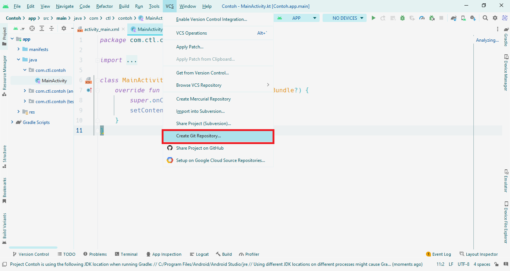
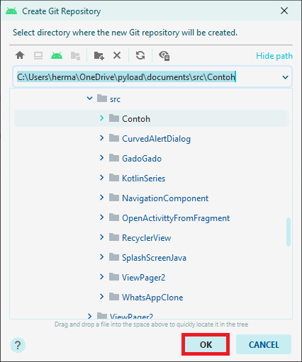
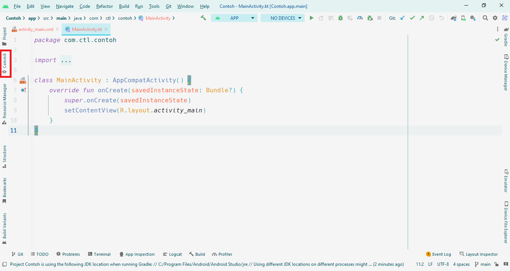
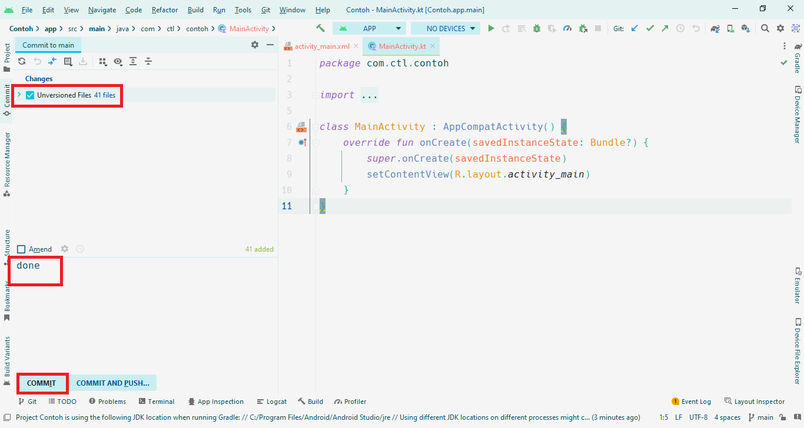
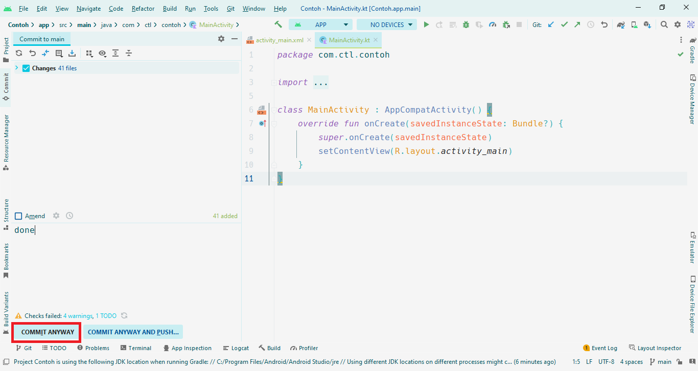
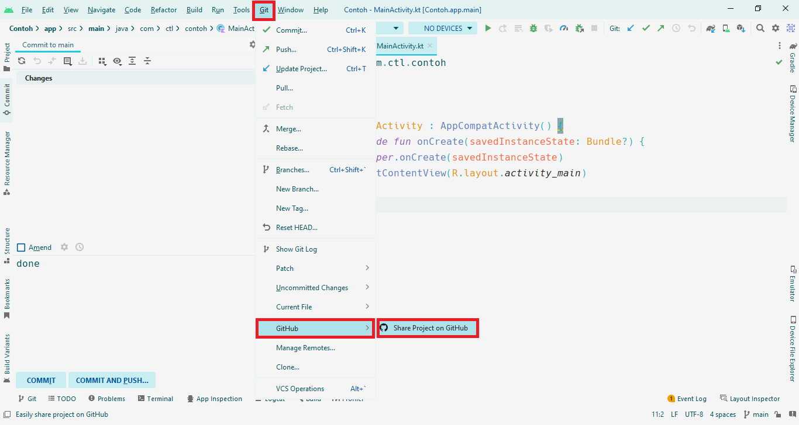
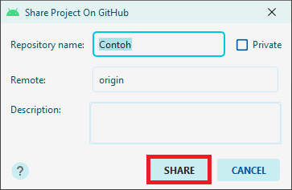
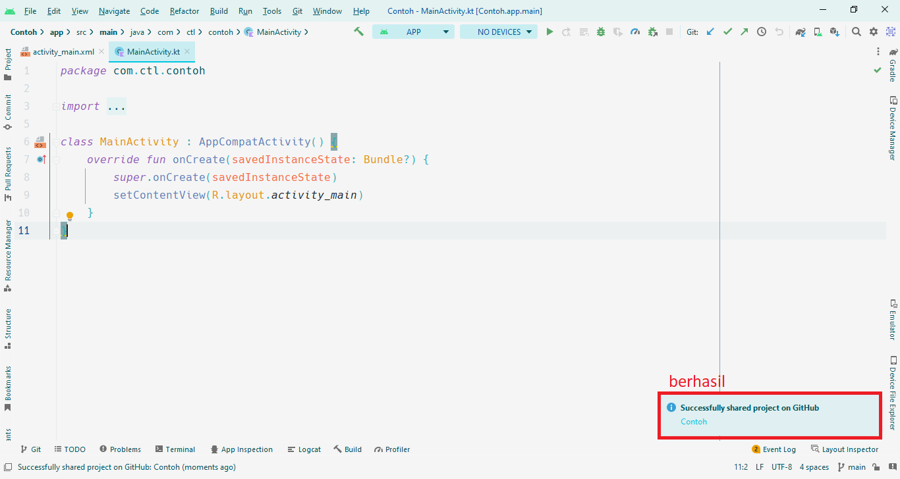

# Cara Git Push Project dari Android Studio ke GitHub

### Kiri -> langkah ke-1; Kanan -> langkah ke-2
 

### Kiri -> langkah ke-3; Kanan -> langkah ke-4
 

### Kiri -> langkah ke-5; Kanan -> langkah ke-6
 

### Kiri -> langkah ke-7; Kanan -> langkah ke-8
 